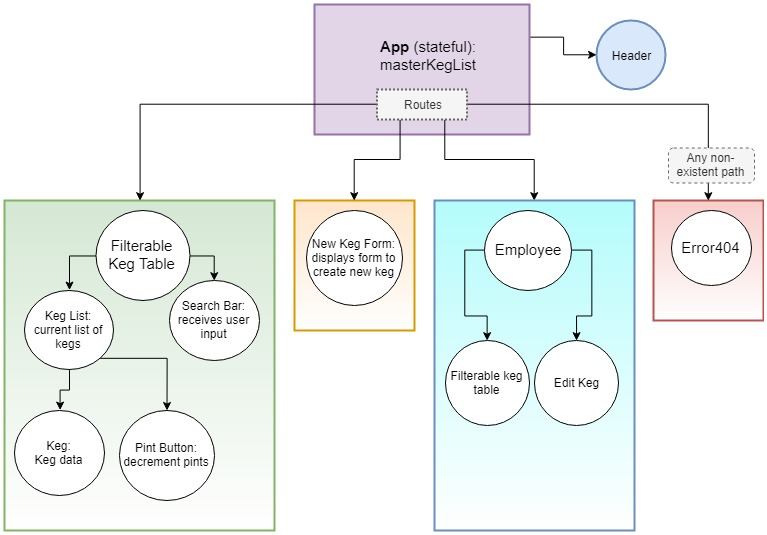

# Taproom Manager
### Rochelle Roberts

<br/>

## Description

Taproom Manager is a React app for tracking inventory.

<br/>

## Installing Taproom

Clone this repository on your machine and install dependencies.

```sh
$ git clone https://github.com/rochellev/TaproomManager.git
$ cd TaproomManager
$ npm install
```
<br/>

## Running Taproom

#### `npm start`

Runs the app in the development mode.

<br/>

## User Stories

#### `Patrons` and `Employees`
- A patron can see a list of tapped kegs so they can order.
- An employee can also see a list of tapped kegs so they can track the beers in their taproom.
- The list a patron can see includes each beer's name, brewer, alcoholic content,price, and pints left in keg.
- The lower priced beers will be green so that patrons can quickly identify special deals.
- The number of pints left in a keg is updated so that both patrons and employees can keep track of the keg status.
- An employee is alerted when the number of pints left runs low so that they can better manage their taproom.
- An employee can add a new keg to the tapped kegs so that they can keep the list current. Patrons cannot add new kegs.
- An employee can click on a keg card in the keg list to edit or delete that keg so they can fully manage their taproom.
- A patron cannot add, edit or delete a keg to make sure the taproom's keg list is accurate.


<br/>

## Component Design



<br/>

## Technologies Used

* React
* JavaScript (JSX)
* HTML
* CSS
* Bootstrap
* Webpack
* Babel
* ESLint

<br/>


## In Progress
- login -- employee vs patron
- tracking keg's pints
- button for pint decrement
- styling
- pre made component: https://www.learnhowtoprogram.com/react/managing-state/library-feature-premade-components

- https://github.com/epicodus-lessons/react-help-queue-example/blob/2_0h_lifting_state/src/components/NewTicketForm.jsx

