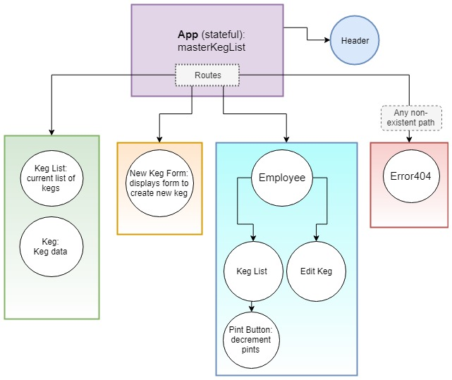

# Taproom Manager
### Rochelle Roberts


## Description

Taproom manager is a react app for tracking inventory.

## Installing Taproom

Clone repo on your machine and install dependencies.

```sh
$ git clone https://github.com/rochellev/TaproomManager.git
$ cd  TaproomManager
$ npm install
```

## Running Taproom

### `npm start`

Runs the app in the development mode.<br>


## Component Design




## Technologies Used
* React
* JSX
* CSS
* Webpack
* Babel
* ESLint